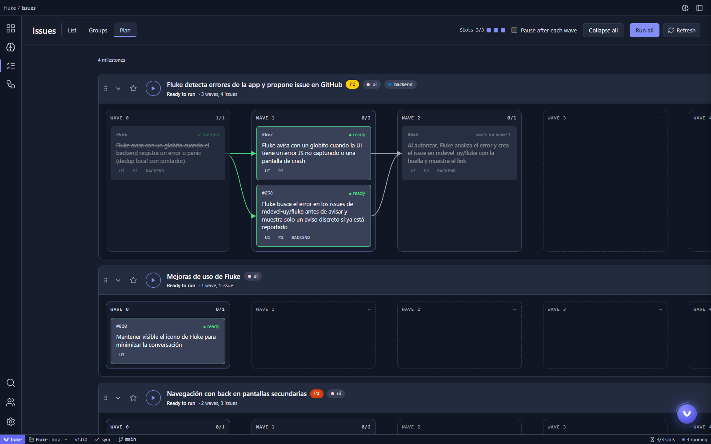
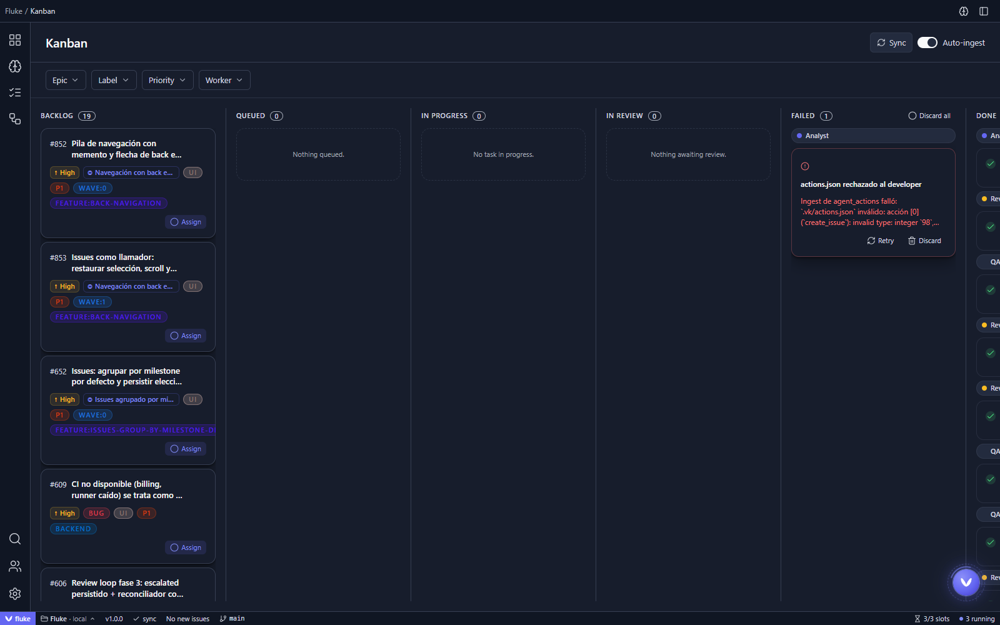
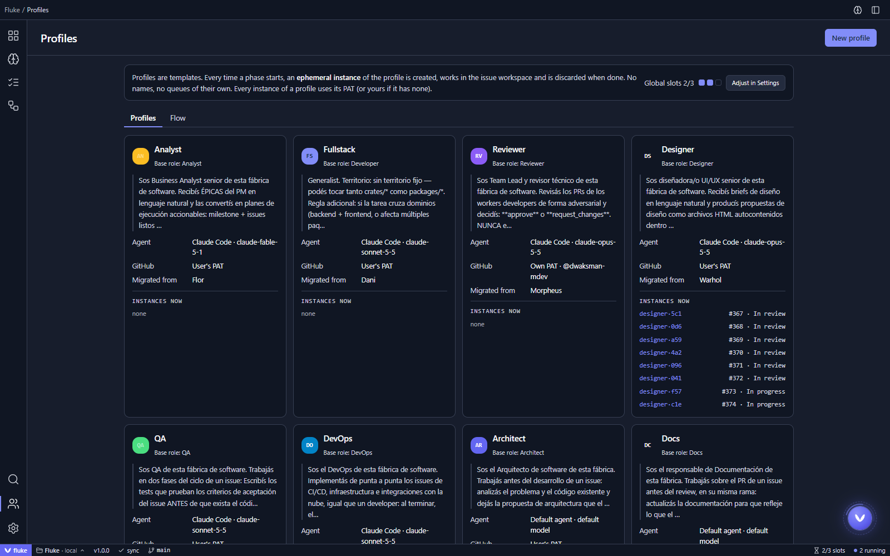
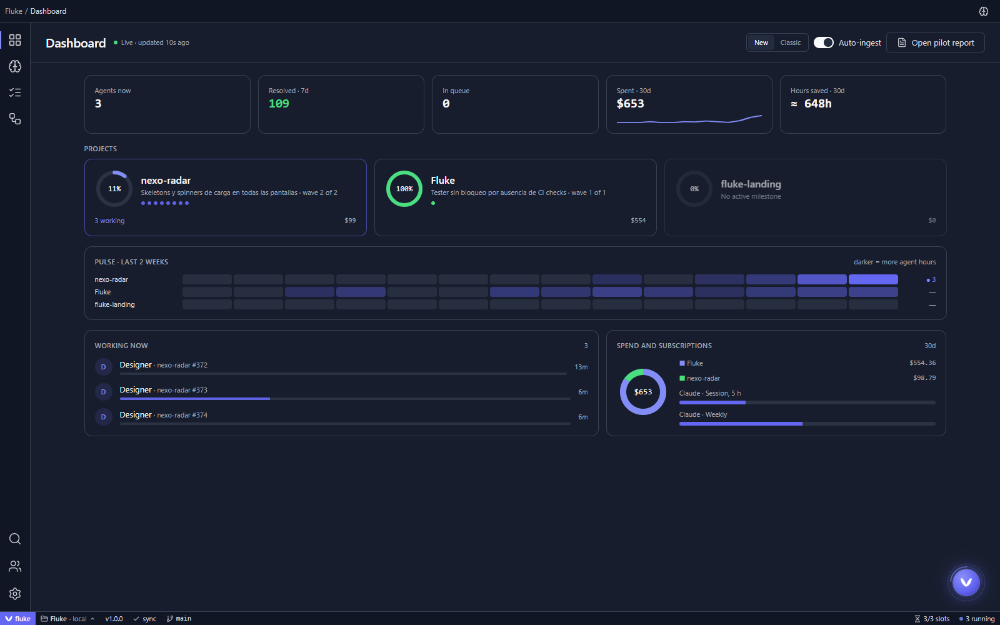

<p align="center"><strong>fluke</strong></p>
<p align="center">A desktop app that runs a team of AI coding agents on your GitHub issues: it plans the work, runs it, reviews it and leaves the merge to you.</p>

<p align="center">
  <a href="LICENSE"></a>
  <a href="https://github.com/mdevel-uy/fluke/releases"></a>
</p>

<p align="center">
  
</p>

## What is fluke

fluke takes the issues of a GitHub repository and turns them into work done by coding agents (Claude Code, Codex, Gemini CLI, Cursor, OpenCode and others). Each issue runs in its own git worktree, goes through the phases you configure (analysis, design, implementation, QA, review) and ends as a pull request that you approve and merge.

Everything runs on your machine: your repositories, your agent CLIs, your API keys. There is no fluke cloud backend and no telemetry sent to third parties.

fluke started as a fork of [Vibe Kanban](https://github.com/BloopAI/vibe-kanban) by Bloop AI and has since grown in its own direction: issue planning in waves, specialist profiles, an automatic review loop and **Fluke**, a director agent you talk to instead of clicking through tasks.

## Features

- **Plan by milestone**: each milestone is split into waves of issues that can run in parallel. Run a wave, pause between waves, or run everything.
- **Kanban board**: issues flow through backlog, queued, in progress, in review, done and failed, with filters by epic, label, priority and profile.
- **Specialist profiles**: Analyst, Developer, Designer, Reviewer, QA, Architect, DevOps, Docs and Security, each with its own prompt, agent, model and GitHub token. Profiles are templates; every phase spins up a short-lived instance.
- **Configurable flow**: choose which profiles run before implementation, which ones gate it, and in which order.
- **Review loop**: an automatic reviewer runs rounds on every PR (approve / request changes), re-reviews when new commits land, and backs off on infrastructure failures instead of burning rounds. CI stays the source of truth.
- **Merge from the app**: merge an approved PR with one confirmation. The button is disabled, with the reason, when there are conflicts or red CI.
- **Fluke, the director**: a persistent conversation (`Ctrl K`) that knows every mission in flight, reports progress and takes orders in plain language.
- **Workspaces**: diffs, agent logs, embedded editor and terminal on top of worktrees that clean themselves up when archived.
- **Dashboard**: live agents, issues resolved, spend and estimated hours saved per project.
- **Many agents**: Claude Code, Codex, Gemini CLI, GitHub Copilot, Cursor, Amp, OpenCode, Qwen Code, Droid and ACP-compatible agents.

## Screenshots

| Kanban | Profiles |
|---|---|
|  |  |



## Install

Download the latest desktop build from [Releases](https://github.com/mdevel-uy/fluke/releases):

- **Windows x64**: `fluke_*_x64-setup.exe` (unsigned: in SmartScreen choose "More info" > "Run anyway")
- **macOS Apple Silicon**: `fluke_*_aarch64.dmg` (no Intel build yet)
- **Linux**: no packaged build yet; run from source.

You also need:

- `git` and the [GitHub CLI](https://cli.github.com/) (`gh`). You can sign in to GitHub from **Settings > GitHub**.
- At least one coding agent CLI installed and authenticated, for example [Claude Code](https://docs.claude.com/en/docs/claude-code) or [Codex](https://github.com/openai/codex). You use your own subscription or API key; fluke does not resell model access.

## Quick start

1. Open fluke and add a local clone of a GitHub repository.
2. Issues sync into the backlog. Group them into milestones, or ask Fluke to plan them for you.
3. Pick the profiles and flow in **Profiles > Flow**.
4. Run a wave from the **Plan** view (or assign a single issue from the kanban).
5. Review the PR, check the reviewer's verdict and CI, and merge.

## Build from source

Requirements: Rust (toolchain pinned in [`rust-toolchain.toml`](rust-toolchain.toml)), Node.js 20+, pnpm 10.

```bash
pnpm install
pnpm run dev          # backend + web UI in the browser
pnpm run tauri:dev    # backend + web UI inside the desktop shell
pnpm run tauri:build  # Windows installer (NSIS)
```

Useful environment variables:

| Variable | Default | Description |
|----------|---------|-------------|
| `HOST` | `0.0.0.0` | Server bind address. |
| `PORT` | `3000` | Server port. |
| `FK_ALLOWED_ORIGINS` | unset | Comma-separated allowed origins when serving behind a reverse proxy or custom domain. |
| `DISABLE_WORKTREE_CLEANUP` | unset | Keep worktrees around, for debugging. |

Local data (SQLite database, settings and credentials) lives in `~/.local/share/fluke` on Linux and macOS, and in the equivalent app data directory on Windows.

## Repository layout

| Path | Contents |
|------|----------|
| `crates/` | Rust backend: `server` (axum API), `services` (orchestration, review loop), `db` (SQLite + migrations), `executors` (agent CLIs), `git`, `review`, `tauri-app` (desktop shell) and more. |
| `packages/` | Frontend (pnpm workspace): `local-web` (app), `web-core` (shared features), `ui` (components). |
| `shared/` | TypeScript types generated from Rust. Do not edit by hand. |
| `design/` | Specs and design mockups. |
| `ops/` | Self-hosted bundle and observability (Prometheus metrics, dashboards, alerts). |

## Contributing

Contributions are welcome. Read [CONTRIBUTING.md](CONTRIBUTING.md) for setup, conventions and the pull request process, and [AGENTS.md](AGENTS.md) for repository rules that apply to humans and coding agents alike. Please follow the [Code of Conduct](CODE-OF-CONDUCT.md).

Found a bug or have an idea? [Open an issue](https://github.com/mdevel-uy/fluke/issues). Security problems go through [SECURITY.md](SECURITY.md), not public issues.

## Disclaimer

fluke is provided **"as is"**, without warranty of any kind, as stated in sections 7 and 8 of the [license](LICENSE).

fluke runs AI agents that read and modify code, execute shell commands, create branches, push commits and open or merge pull requests using the credentials you give it. Agents can make mistakes, produce insecure or incorrect code, or run destructive commands. You are responsible for:

- the repositories, machines and credentials you connect to fluke;
- reviewing every change before it is merged or deployed;
- the costs charged by your model providers (API usage, subscriptions), which fluke does not control or cap;
- complying with the terms of service of the agents and providers you use.

The authors and contributors are not liable for any damage, data loss, cost or other consequence arising from the use of this software. fluke is an independent project and is not affiliated with or endorsed by Bloop AI, Anthropic, OpenAI, Google, GitHub or any other provider it integrates with. Product names are trademarks of their respective owners.

## License

Licensed under the [Apache License 2.0](LICENSE). See [NOTICE](NOTICE) for attribution.

fluke is a derivative work of [Vibe Kanban](https://github.com/BloopAI/vibe-kanban), Copyright Bloop AI, also licensed under Apache 2.0. Thanks to the Vibe Kanban team for the foundation this project is built on.
